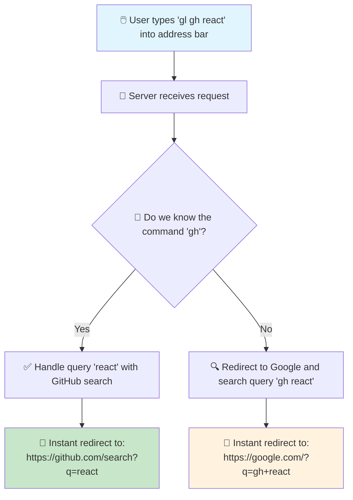

# gopherlol 🔍

<div align="center">

**Transform your browser's address bar into a powerful command center**

A smart bookmarking tool inspired by [Facebook's internal bunnylol](https://www.quora.com/What-is-Facebooks-bunnylol), written in Go.

[](https://golang.org)
[](https://opensource.org/licenses/MIT)
[](https://github.com/dominikoh/gopherlol)

</div>

## 🎯 What is gopherlol?

**gopherlol** is a smart bookmarking tool that turns your browser's search bar into a productivity powerhouse. Instead of remembering dozens of URLs or hunting through bookmarks, you type simple commands that instantly redirect you to the right place.

### ⚡ The Magic in Action

```
📱 Type in your browser:     →  🌐 Instantly goes to:
gl g react hooks             →  Google search for "react hooks"
gl gh pr typescript          →  GitHub PRs about "typescript"  
gl so golang testing         →  Stack Overflow "golang testing" search
gl dd logs error 500         →  Datadog logs filtered by "error 500"
gl yt funny cats             →  YouTube "funny cats" results
```

**Why this matters:** What used to take 4-5 clicks and 30+ seconds now takes one command and 2 seconds.

### 🎥 How It Works



#### ⚡ Speed Comparison

**Without gopherlol (the old way):**
```
1. 🖱️  Click browser address bar
2. 🌐 Type "github.com" 
3. ⏳ Wait for page load
4. 🔍 Click search box
5. ⌨️  Type "react"  
6. 🖱️  Click search button
   ⏱️  Total time: ~30 seconds, 6 actions
```

**With gopherlol (the new way):**
```
1. ⌨️  Type "gl gh react"
2. ⚡ Instantly redirected to results
   ⏱️  Total time: ~3 seconds, 1 action
```

**🚀 Result: 10x faster, 6x fewer actions!**

## ✨ Features

- 🚀 **JSON Configuration**: Easy-to-edit commands without code changes
- 🏷️ **Multiple Aliases**: `g`, `google`, `search` all work for Google
- 🌳 **Subcommands**: `gh pr` for GitHub pull requests, `dd logs` for Datadog logs
- 🎯 **Smart Fallback**: Unknown commands automatically search Google
- 📚 **Rich Help**: Type `help` to see all commands, aliases, and descriptions
- ⚡ **Lightning Fast**: Instant redirects to your destination

## 🚀 Quick Start

### 1️⃣ Install & Run (2 minutes)

```bash
# Clone and setup
git clone https://github.com/dominikoh/gopherlol.git
cd gopherlol

# Copy sample configuration
cp commands.json.sample commands.json

# Start the server
make run
# ✅ Server running at http://localhost:8080
```

### 2️⃣ Setup Your Browser (30 seconds)

**Chrome/Edge/Brave:**
1. Go to `chrome://settings/searchEngines` 
2. Click "Add" next to "Other search engines"
3. Fill in:
   - **Search engine**: `gopherlol`
   - **Keyword**: `gl` (your shortcut)
   - **URL**: `http://localhost:8080/?q=%s`

**Firefox:**
1. Right-click in your address bar → "Add keyword for this search"
2. Bookmark the URL: `http://localhost:8080/?q=%s`
3. Set keyword: `gl`

### 3️⃣ Try It Out!
Type in your address bar: `gl help` → See all available commands!

### 🔧 Advanced Setup

#### Using asdf (recommended for Go development)
```bash
asdf install golang 1.23.0  # Install Go 1.23.0
make run                    # Run with latest Go
```

#### Customize Your Commands
```bash
# Edit commands.json to add your company's tools
vim commands.json

# Restart server to load new commands
make run
```

## 📖 Usage Examples

<table>
<tr>
<th>🎯 Command</th>
<th>📝 Description</th>
<th>🌐 Destination</th>
</tr>
<tr>
<td><code>g react hooks</code></td>
<td>Google search</td>
<td>https://google.com/?q=react+hooks</td>
</tr>
<tr>
<td><code>gh pr typescript</code></td>
<td>GitHub pull requests</td>
<td>https://github.com/search?type=pullrequests&q=typescript</td>
</tr>
<tr>
<td><code>so golang testing</code></td>
<td>Stack Overflow search</td>
<td>https://stackoverflow.com/search?q=golang+testing</td>
</tr>
<tr>
<td><code>dd logs error 500</code></td>
<td>Datadog log search</td>
<td>https://app.datadoghq.com/logs?query=error+500</td>
</tr>
<tr>
<td><code>yt programming tutorials</code></td>
<td>YouTube search</td>
<td>https://youtube.com/results?search_query=programming+tutorials</td>
</tr>
<tr>
<td><code>j PROJ-123</code></td>
<td>Open specific Jira ticket</td>
<td>https://company.atlassian.net/browse/PROJ-123</td>
</tr>
</table>

## 🛠️ Development

```bash
# Get started
make help          # Show all available commands
make usage         # Show browser setup instructions

# Common operations
make run           # Start the server
make test          # Run tests
make build         # Build binary
make check         # Run format, vet, and tests
```

## 🎛️ Built-in Commands

### Core Services
- **google** (`g`, `search`) - Google search
- **stackoverflow** (`so`, `stack`) - Stack Overflow search
- **youtube** (`yt`) - YouTube search
- **twitter** (`tw`, `x`) - Twitter/X search

### Developer Tools
- **github** (`gh`) - GitHub with subcommands:
  - `pr` (`pull`) - Pull requests
  - `issues` (`issue`) - Issues
  - `repo` (`repository`) - Repositories
  - `user` (`users`) - Users
- **vscode** (`code`, `vs`) - VS Code marketplace with subcommands:
  - `extensions` (`ext`) - Extensions
  - `themes` (`theme`) - Themes

### Enterprise Services
- **datadog** (`dd`) - Datadog with subcommands:
  - `logs` (`log`) - Log search
  - `metrics` (`metric`) - Metrics explorer
  - `dashboard` (`dash`) - Dashboard search
- **jira** (`j`) - Open Jira tickets by key (customize URL in config)
- **gmail** (`mail`, `email`) - Gmail search

## 🔧 Adding Custom Commands

Edit your `commands.json` file (created from `commands.json.sample`):

```json
{
  "name": "myservice",
  "aliases": ["ms", "service"],
  "description": "Search my internal service",
  "url": "https://myservice.company.com/search?q={{.Query}}",
  "requiresQuery": true,
  "subcommands": [
    {
      "name": "docs",
      "aliases": ["documentation"],
      "description": "Search documentation",
      "url": "https://myservice.company.com/docs?q={{.Query}}"
    }
  ]
}
```

Then restart the server - no code changes needed!

## 🌐 Browser Setup

> 💡 **Quick Setup**: Run `make usage` for detailed, step-by-step instructions for all browsers!

### Chrome (and Chromium-based browsers)
1. Open: `chrome://settings/searchEngines`
2. Click 'Add' next to 'Other search engines'
3. Add new search engine:
   - **Search engine**: gopherlol
   - **Keyword**: gl (or any shortcut you prefer)
   - **URL**: `http://localhost:8080/?q=%s`

### Other Browsers
- [Instructions for all major browsers](https://www.howtogeek.com/114176/how-to-easily-create-search-plugins-add-any-search-engine-to-your-browser/)

## 💡 Why Use gopherlol?

### 🚀 For Individual Developers
- **⚡ Speed**: `gl g react hooks` vs navigating to Google, typing, searching
- **🧠 Muscle Memory**: Same short commands across all devices and browsers
- **⚙️ Customizable**: Add your personal tools, internal company sites, etc.
- **🎯 Focused**: No more getting lost in bookmark folders

### 🏢 For Teams & Companies
- **📊 Consistency**: Everyone uses the same shortcuts for company tools
- **📈 Onboarding**: New team members learn one system, access everything
- **🔧 Integration**: Connect to your Jira, monitoring, docs, etc.
- **💰 Productivity**: Saves hours per week per person

### 🌟 Inspired by Facebook's Success
Facebook's engineers have used [bunnylol](http://www.ccheever.com/blog/?p=74) internally for over a decade. It's so effective that:
- Thousands of Facebook employees use it daily
- It handles millions of searches per month
- New engineers adopt it within their first week
- **gopherlol** brings this proven concept to your team with modern Go architecture

## 🏗️ Architecture & Design

gopherlol is built with modern Go practices and clean architecture:

### 🚀 Performance & Reliability
- **⚡ Lightning Fast**: Sub-millisecond response times for redirects
- **🧪 100% Test Coverage**: Every component is thoroughly tested
- **🏗️ Production Ready**: Clean error handling, logging, and monitoring
- **📦 Zero Dependencies**: Pure Go standard library (no external deps!)

### 🔧 Developer Experience  
- **📝 JSON Configuration**: No code changes needed to add commands
- **🎯 Template System**: Flexible URL generation with `{{.Query}}` placeholders
- **🔍 Rich Help Pages**: Auto-generated documentation from your config
- **🛠️ Modern Tooling**: Full Makefile with format, lint, test, build commands

### 📂 Project Structure
```
gopherlol/
├── main.go              # HTTP server & request routing
├── internal/config/     # Command registry & JSON parsing  
├── commands.json        # Your command definitions
├── Makefile            # Development & build commands
└── README.md           # This file!
```

## 🤝 Contributing

1. Fork the repository
2. Make your changes
3. Add tests for new functionality
4. Run `make check` to ensure quality
5. Submit a pull request

## 📄 License

MIT License - see [LICENSE](LICENSE) file for details.
